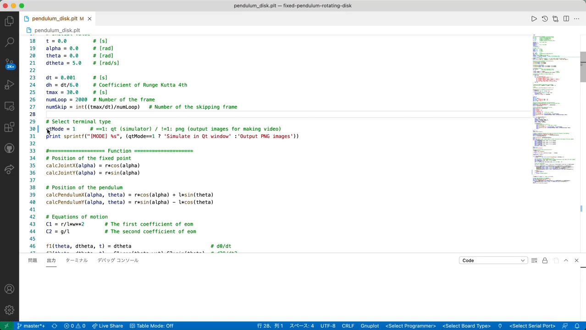
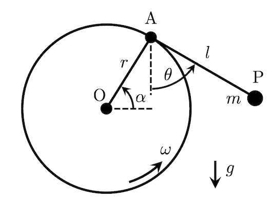

# pendulum-fixed-to-rotating-disk
- **teminal: `qt`**
 
<!--  -->

- **teminal: `pngcairo`**  
  Note: To create a video from PNG images, you use ffmpeg. 


## Overview
"fixed-pendulum_rotating-disk" is a **mechanical simulator with gnuplot**.
This simulator is involved with the pendulum fixed to the edge of a rotating disk.

## Requirement
<!-- # Requirement -->
- macOS Big Sur 11.4 / Macbook Air (M1, 2020) 16GB
- gnuplot version 5.4 patchlevel 1

<!-- # Installation -->
 
## Usage
```
git clone https://github.com/hiroloquy/mechanics.git
cd pendulum-fixed-to-rotating-disk
gnuplot
load 'pendulum_fixed_to_rotating_disk.plt'
```
Please check the value of `qtMode` before running.

## Features
You enable to switch terminal type `qt` or `pngcairo` by using **`qtMode`**.
- If you select `qt` terminal (`qtMode==1`), gnuplot opens qt window and you can run this simulator.

- On the other hand, in `pngcairo` terminal (`qtMode!=1`), you can get a lot of PNG images of the simulation.
By using the outputted images, you can make a video or an animated GIF.

## Modeling


### Position of the point P


### Lagrange's equation


### Equation of motion


## Note
- When changing the initial value or parameter value, you don not forget to write a decimal point in the number (**float**). If the value does not have a decimal point, gnuplot regards the value as **int**, and the calculation accuracy will be poor!

- I made a MP4 file (png2movie.mp4) and an animated GIF file (movie2anime.gif) by using **ffmpeg**.

```
cd pendulum-fixed-to-rotating-disk
ffmpeg -framerate 60 -i png/img_%04d.png -vcodec libx264 -pix_fmt yuv420p -vf "scale=trunc(iw/2)*2:trunc(ih/2)*2" -r 60 png2video.mp4
```
 
<!-- ## Reference -->

## Author
Hiro (Twitter: [@Sm_pgmf](https://twitter.com/Sm_pgmf))
 
## License
[Hiroloquy](https://hiroloquy.com/)
 
